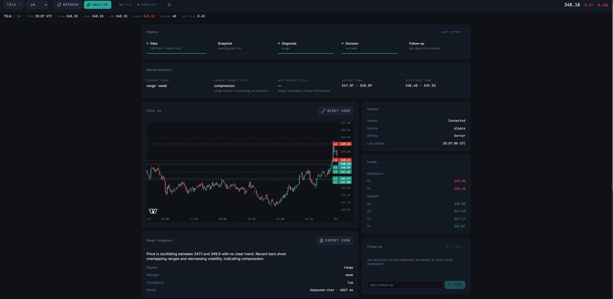

# Candle Agent

📈 I wanted to know whether an LLM can actually read a chart. Not whether it can *sound* like it can — whether it can.

So I built two things. A system that streams live market data, asks an LLM what it sees, and shows you the answer. And a harness that grades every one of those answers against what the market did next.

The second part is the interesting one. It told me the model doesn't work.

**It does not connect to a broker and it does not place orders.** It tells you what it sees, and I check whether it was right.

---

## What it does

- 📈 **Streams live candles** from Alpaca (US stocks + crypto) or Binance
- 🧠 **Two-stage analysis** — first describe the market, then decide what to do about it
- 🛡️ **Checks the model's work** — schema, geometry, and consistency, with retries
- 📡 **Pushes results live** to your browser over SSE
- 📊 **Draws it on the chart** — entry, stop, target, and key levels
- ⏪ **Replays history** through the same pipeline, one bar at a time
- 🎯 **Scores every call** against what actually happened next
- 🚫 **Refuses to report numbers** the sample can't support
- 🔑 **Bring your own API key** — yours, not mine, and it never touches my server
- 🔀 **Runs as separate services** over NATS, so a slow model can't block data
- 📉 **Prometheus metrics** on everything

---

## Why two stages

I tried one prompt first. The model would jump straight to "buy here" without ever saying what kind of market it was looking at, and the answers were all over the place.

So I split it in half.

**Stage 1 only describes.** What's the regime, where are the levels, is the range expanding or contracting. No trade talk allowed.

**Stage 2 reads that description and decides.** Entry, stop, target, and why. Or no trade — which is a real answer and happens a lot.

The point is that stage 2 inherits stage 1 as a commitment, not a suggestion. It can't invent a long setup after stage 1 said bearish, because the playbook it gets routed to won't allow it. That one change did more for output quality than any prompt tuning I tried.

---

## Does it work?

No. Here's how I know.

I replay historical bars through the live pipeline one at a time, with the analyzer unable to tell replay from live. It never sees a bar from the future — that's enforced in the query and tested with a check that deliberately breaks the guard to make sure the test would notice.

Then I grade every analysis against the next 30 bars.

**Across two runs on different days:**

| | Model | A predictor that ignores the chart |
|---|---|---|
| Regime accuracy | 0.500 | 0.833 |
| Cycle accuracy | 0.375 | 0.750 |

**And the finding that replicated:** the model claimed a trend 16 times across two samples that share no bars. It was right zero times.

The first run happened during a week with almost no trends, so you could argue it never had a chance. The second run had real trends in it. Same result.

The trade grader still can't say anything — it needs ~100 resolved trades and has 4.

Full numbers, caveats and per-row tables: [`docs/results.md`](docs/results.md)

---

## Why the harness refuses to answer

This is the part I'd want you to look at.

25 analyses on consecutive bars, each graded over the next 30 bars, share 29 of every 30 bars with their neighbour. That's one observation, not 25. Row count is not sample size.

So the scorer counts how many forward windows are actually disjoint, and when there aren't enough it says so instead of printing a number:

```
Cannot support a regime accuracy against the majority-class baseline:
25 rows, but only 1 independent window (5 needed). Overlapping forward
windows inflate the row count without adding information — raise the
replay stride.
```

The fix was to space the decision bars out. Same token cost, real observations.

Every threshold is stored with the score, so any of them can be re-swept later without spending a cent. And the cycle threshold was swept on MSFT and then used to grade AAPL — chosen before the data it scores, not after.

Design reasoning: [`docs/scoring-design.md`](docs/scoring-design.md)

---

## How it's put together

```
data source ─▶ ingest ─▶ NATS ─▶ analyzer ─▶ SSE ─▶ browser
                          │          │
                       replay      SQLite
```

This was one script at first. I broke it up because a 5-second LLM call was blocking data ingestion, and I wanted to restart the analyzer without dropping candles.

Now each piece runs in its own container and talks only over NATS.

Design notes and the bugs worth reading about: [`docs/architecture.md`](docs/architecture.md)

---

## Data sources

| Source | What you get | Keys needed |
|---|---|---|
| `alpaca` **(default)** | US stocks + crypto, 13k symbols | `ALPACA_KEY_ID`, `ALPACA_SECRET_KEY` |
| `binance` | Crypto pairs | none |
| `demo` | Synthetic bars for offline work | none |

**Binance can't be the default.** It returns HTTP 451 from US IP addresses, AWS included. That shows up as a `region_blocked` message in the UI rather than a silent hang.

**Two Alpaca hosts, and mixing them up costs an afternoon.** `ALPACA_BASE_URL` is for trading endpoints, `ALPACA_DATA_URL` is for bars. Neither may end in `/v2` — the code adds that, so a versioned URL becomes `/v2/v2/assets` and 404s. Startup rejects it with an explicit message now.

**Free-plan history is capped.** 1m through 1h give you the full 200 bars; 4h gives about 60 because equity intraday stops around 35 days back. Short backfills say so in the UI.

Real bars and demo bars are marked at the row level, and every read filters to real data by default. I learned that one the hard way, twice.

---

## Bring your own key

You can run analyses on your own LLM credentials.

- The key stays in your browser. By default it's in memory only and a reload clears it.
- You can tick a box to save it in this browser. It then survives a reload and is readable by anyone with access to your machine — the panel says so plainly.
- Either way it **never gets stored on my server**. It rides one request header, gets used for one call, and is discarded.
- It never reaches the message bus, because JetStream writes messages to disk.
- Provider error bodies are dropped on auth failures, because they echo your key back.

There's a test that runs a real analysis and asserts the key appears in no log, no response, no database row and no bus message.

---

## Requirements

| | |
|---|---|
| OS | Linux, macOS, Windows (via Docker) |
| Docker | Compose v2 |
| Python | 3.11+ (local dev only) |
| Node | 20+ (terminal only) |
| Network | Access to your LLM provider |

---

## Quick start

```bash
git clone https://github.com/epicconnnnor/Candle-Agent.git
cd Candle-Agent
cp .env.example .env     # add your keys
docker compose up -d --build
```

Then the terminal:

```bash
cd terminal
npm install
npm run dev
```

Open http://localhost:5174

Two things that will save you time:

`docker compose restart` does **not** pick up an edited `.env`. Use `up -d`.

`docker compose up -d` does **not** rebuild images after a code change. Use `up -d --build`.

---

## Running a replay

Price it before you spend anything:

```bash
curl -X POST localhost:8000/api/replay \
  -H 'content-type: application/json' \
  -d '{"symbol":"AAPL","interval":"1m","stride":30,"max_analyses":12,"dry_run":true}'
```

Drop `dry_run` to run it. Then score it:

```bash
curl -X POST localhost:8000/api/score \
  -H 'content-type: application/json' \
  -d '{"symbol":"AAPL","interval":"1m","replay_run_id":[7,8]}'
```

`max_analyses` is required. There's no way to start a run without saying how much you're willing to spend.

---

## Tests

```bash
pytest
ruff check .
```

276 tests. CI runs those plus an encoding check and a full compose build with health checks on every push.

---

## Stack

| | |
|---|---|
| Services | Python |
| Messaging | NATS JetStream |
| Storage | SQLite (WAL) |
| Transport | Server-Sent Events |
| Metrics | Prometheus |
| Frontend | React, TypeScript, Vite, Tailwind |
| Charting | lightweight-charts |
| CI | GitHub Actions |

---

## What's next

- [ ] Deploy to AWS (ECS Fargate, Terraform)
- [ ] Postgres instead of SQLite
- [ ] A bigger sample — the trade grader needs ~100 resolved trades and has 4
- [ ] Forex and gold, which needs the scoring thresholds re-swept per asset class

---

**Disclaimer** — This is for learning and research. It is not investment advice. Trading carries risk and your decisions are your own.

## License

MIT
